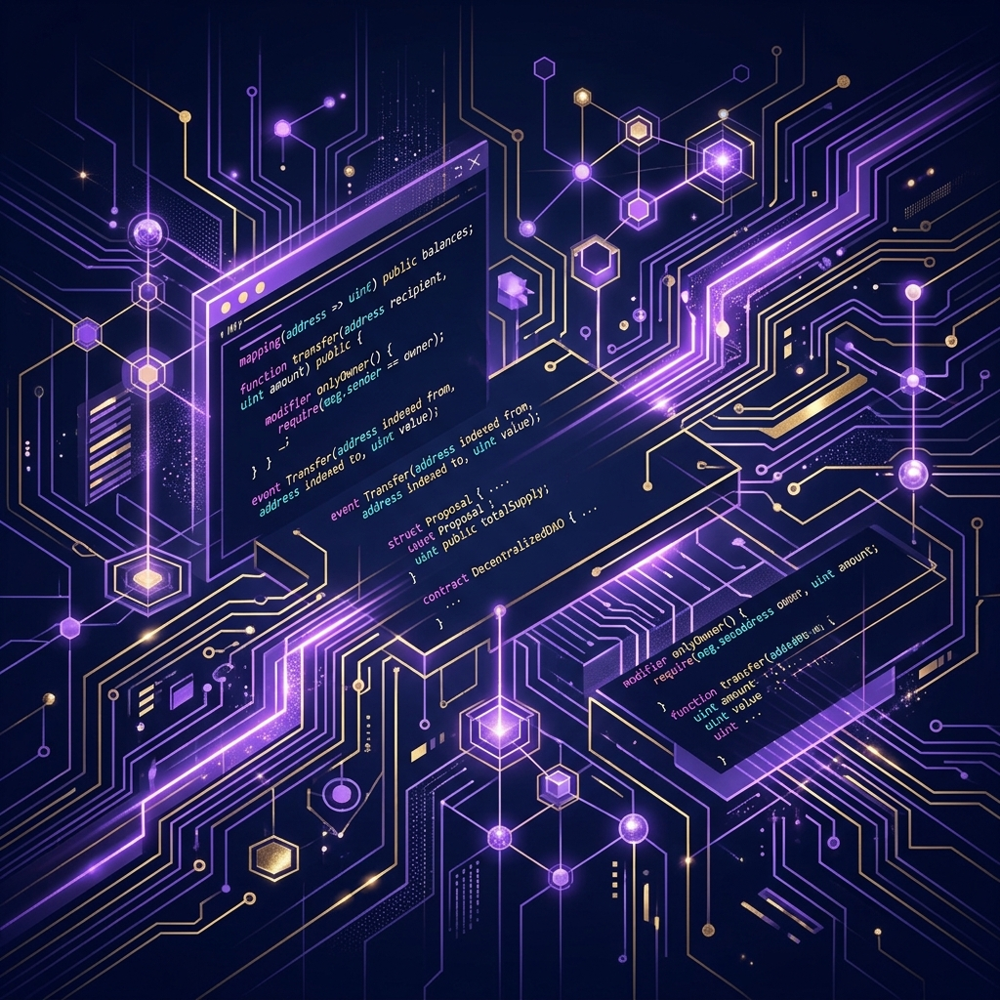
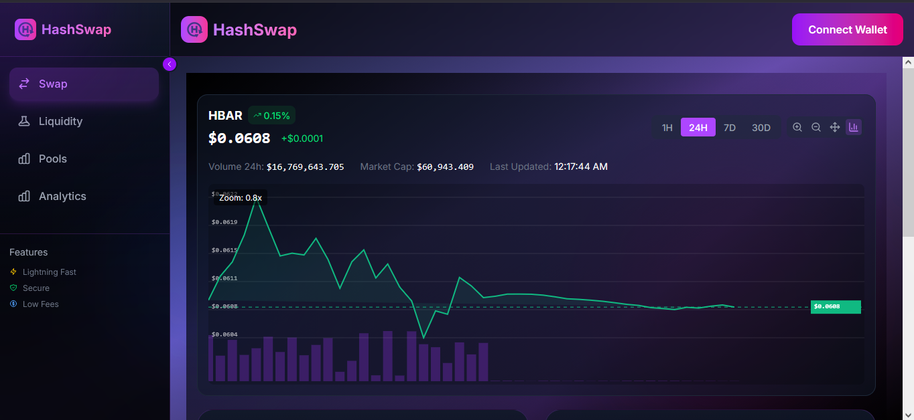
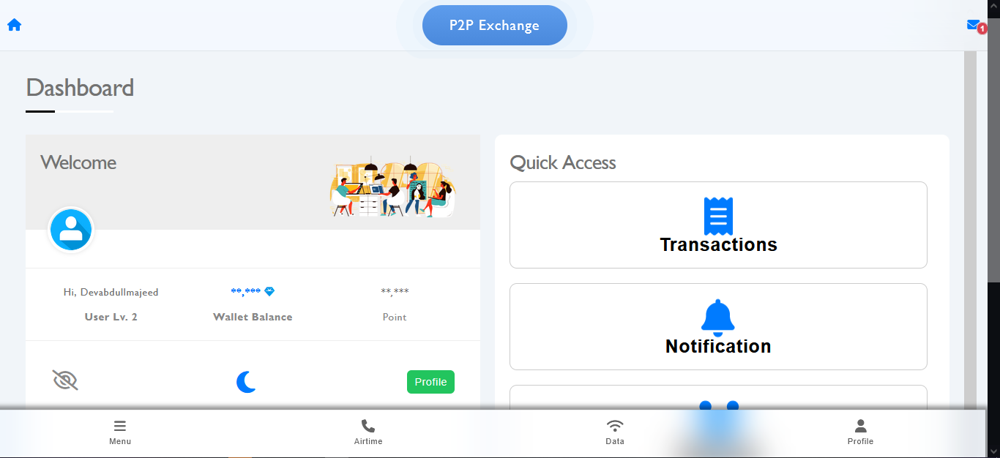
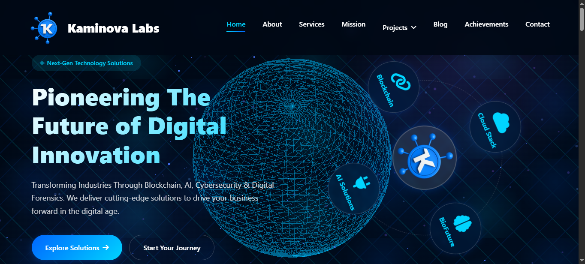
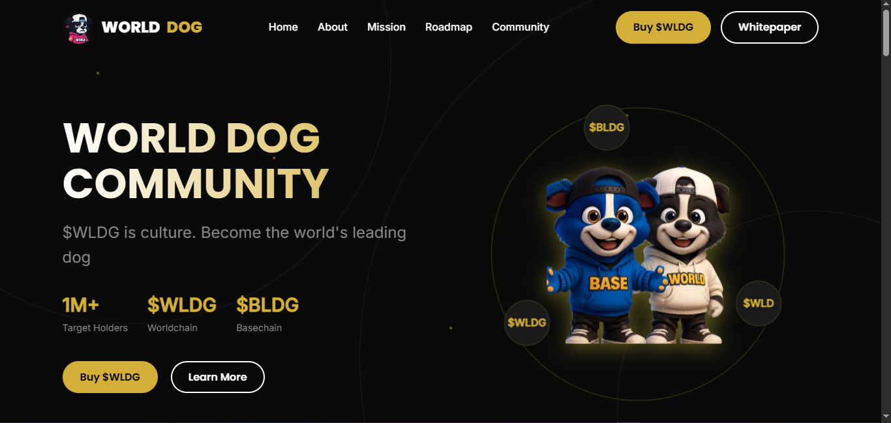
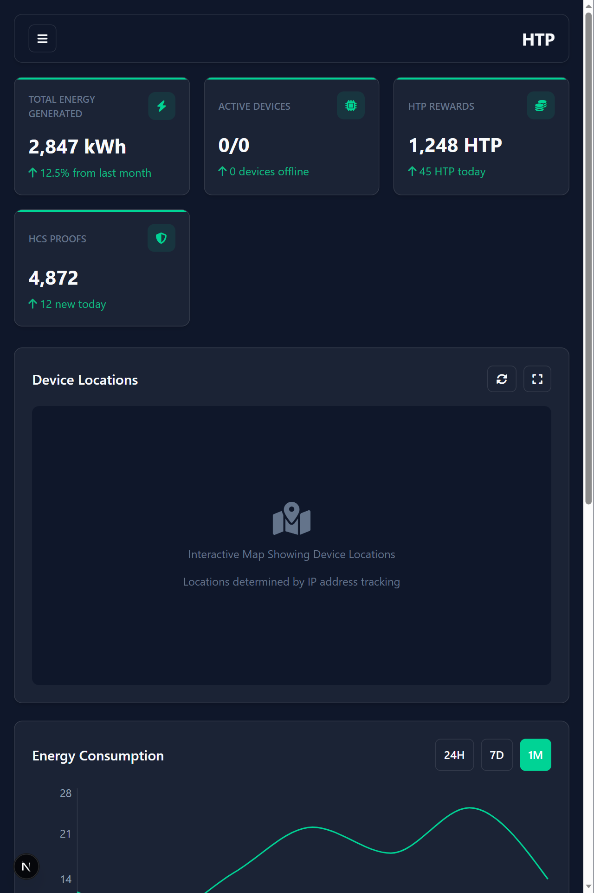
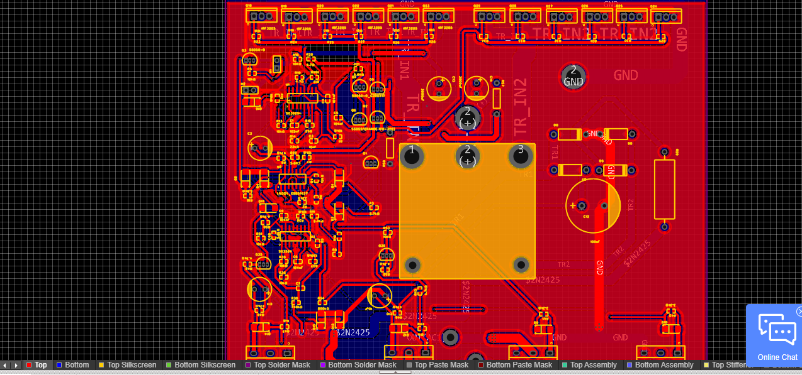

  

<h1 align="center">⚡ Abdullmajid Alhassan Muazu ⚡</h1>

<b>Alias: Dev Abdullmajeed / Dan Almag</b>

<i>Bridging the gap between physical hardware and decentralized networks.</i>

📍 Nigeria | 📧 <a href="mailto:abdulldanalmag@gmail.com">abdulldanalmag@gmail.com</a> | 📞 +234 912 740 6311

  
  
  
  
  

---

## 👋 About Me

I am a versatile **Software, Web3 & IoT Engineer** with over 4 years of experience crafting end-to-end applications that link physical microcontrollers to web architectures and blockchain protocols. I specialize in designing connected hardware solutions and integrating them with secure Web3 infrastructures (TON, EVM, Solana, Hedera) and modern Web2 backends. I thrive on building interactive, high-performance dashboards, real-time automation tools, and smart robotics.

---

## 🛠️ Languages & Tech Stack

### 🌐 Frontend & Core Languages

  
  
  
  
  
  
  

### ⚙️ Backend, Databases & Cloud

  
  
  
  
  
  
  
  

### 🔗 Web3 & Blockchain Engineering

  
  
  
  
  
  

### 🔌 IoT & Embedded Systems

  
  
  
  

> **Specialized IoT Skills:** PCB Design & Schematic Capture | Circuit Simulation (Altium/KiCad/Proteus) | Sensor Integration (MAX30105, DHT11/22, DS18B20, Ultrasonic, Soil Moisture) | Robotics & Automation

### 🛠️ Developer Tools & DevOps

  
  
  
  
  

---

## 💼 Featured Projects

Here is a showcase of some of my key systems, bridging standard frontend design, backend systems, blockchain protocols, and IoT devices.

<table width="100%">
  <tr>
    <td width="50%" valign="top">
        
      <h3><b>⚡ HashSwap DEX Interface</b></h3>
      
A sleek, decentralized exchange interface engineered for token swaps, liquidity pool hosting, and real-time yield monitoring on the Hedera Network.

      

        <a href="https://hedera-swap-ui.vercel.app/" target="_blank"><b>🔗 Live Demo</b></a> | 
        <code>React</code> <code>Tailwind</code> <code>TypeScript</code> <code>Web3.js</code>
      

    </td>
    <td width="50%" valign="top">
        
      <h3><b>💳 Onchain NG Payments</b></h3>
      
A mobile-first on-chain platform that enables users in Nigeria to pay for utility bills, airtime, and data bundles securely using crypto assets.

      

        <a href="https://onchain.com.ng" target="_blank"><b>🔗 Live Demo</b></a> | 
        <code>PHP</code> <code>Ethers.js</code> <code>Web3</code> <code>REST APIs</code>
      

    </td>
  </tr>
  <tr>
    <td width="50%" valign="top">
        
      <h3><b>🧪 Kaminova Labs Platform</b></h3>
      
A comprehensive full-stack corporate web portal featuring a clean responsive UI and an admin dashboard for real-time publishing of events and announcements.

      

        <a href="https://kaminovaglobal.com" target="_blank"><b>🔗 Live Demo</b></a> | 
        <code>PHP</code> <code>MySQL</code> <code>JavaScript</code> <code>Bootstrap</code>
      

    </td>
    <td width="50%" valign="top">
        
      <h3><b>🐕 WLDG Token Hub</b></h3>
      
An IPFS-hosted, fully responsive Web3 community portal showcasing tokenomics, detailed roadmaps, claiming mechanisms, and wallet staking integrations.

      

        <a href="https://wldgtoken.vercel.app/" target="_blank"><b>🔗 Live Demo</b></a> | 
        <code>Next.js</code> <code>HTML5</code> <code>CSS3</code> <code>Web3 Wallets</code>
      

    </td>
  </tr>
  <tr>
    <td width="50%" valign="top">
        
      <h3><b>⚡ IoT Smart Energy Meter</b></h3>
      
An ESP32-based hardware system equipped with energy sensors, logging data locally and over MQTT, coupled with a real-time web dashboard for device monitoring.

      

        <code>ESP32</code> <code>C++</code> <code>MQTT</code> <code>React Native</code> <code>Node.js</code>
      

    </td>
    <td width="50%" valign="top">
        
      <h3><b>🔌 Inverter PCB Design</b></h3>
      
A pure-sine 24V to 220V AC solar-inverter PCB layout. Features full galvanic isolation, DSP-controlled MPPT charging stages, and over-current protection.

      

        <code>PCB Design</code> <code>Circuit Design</code> <code>Schematic Capture</code>
      

    </td>
  </tr>
</table>

### 🛠️ Additional Systems & Hardware Projects
* **🤖 Greenhouse Monitoring Robot:** An autonomous farming robot driven by ESP32 that continuously logs soil parameters and navigates around greenhouse obstacles using ultrasonic pathfinding. (`ESP32` | `C++` | `Robotics`)
* **💓 Wearable Cardiac Alert System:** An IoT medical device that utilizes the MAX30105 sensor array to monitor cardiovascular vitals, alerting care teams instantly via Blynk integration. (`ESP32` | `Sensors` | `Blynk`)
* **🎨 Cyberpunk NFT Marketplace UI:** A responsive, themed mock-marketplace showcasing Web3 wallet integrations and mock transactions simulated on the SEI Blockchain. (`React` | `Tailwind` | `Figma`)

---

## 📊 Git Metrics & Activity

  
    
  

---

## 📈 Dev Goals & Core Focus
* 🚀 **Contribute to Open-Source:** Expanding the capability of Web3 networks and open IoT communication layers.
* 🎓 **Community Mentorship:** Helping junior African developers break into systems programming, electronics, and dApp development.
* 🌐 **Blockchain Architecture:** Integrating physical nodes with decentralized networks for trustless automation.

---

## 📬 Contact & Collaboration

I am always keen to partner on cutting-edge hardware design, advanced full-stack apps, or decentralized systems. Let's make something incredible!

* **Email:** [abdulldanalmag@gmail.com](mailto:abdulldanalmag@gmail.com)
* **Phone / WhatsApp:** [+234 912 740 6311](tel:+2349127406311)
* **Twitter / X:** [@devabdullmajeed](https://twitter.com/devabdullmajeed)
* **Freelancer Profile:** [Dan Almag on Freelancer](https://www.freelancer.co.ke/u/danalmag)
* **Dev Blog:** [danalmag.hashnode.dev](https://danalmag.hashnode.dev)

---

  <i>"Building the decentralized future, one line of code at a time."</i>

